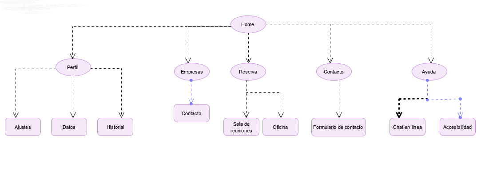

# Trabajo Final DIU
Realizado por Alejandro Bonet Medina

Introducción
-
Este trabajo tiene como objetivo evaluar tu capacidad de aplicación de las técnicas y metodologías de diseño centrado en usuario y UX a un caso real. El caso real será el rediseño de una web para una empresa de coworking, en mi caso he escogido https://cubikate.es/ para analizarla.

# Paso 1. UX Desk Research & Analisis
En primer lugar se debe analizar la experiencia de usuario en esta página, para encontrar así con sus puntos débiles y fuertes; y a partir de estos puntos comenzar con el rediseño. Para ello debemos analizar a los usuarios que harán uso de esta página y como actúan en esta y también analizar aplicaciones similares.

1a.Competive Analisis
-
Cubikate es una empresa dedicada al coworking que se encuentra en Granada, una aplicación similar a esta es erranT. Aunque las dos webs traten de lo mismo podemos encontrar multiples diferencias entre ambas. La más interesante para comentar es que en la web e cubikate no podemos alquilar directamente una sala, ni saber su disponibilidad, precio, etc. Para alquilar una sala en cubikate tienes que ponerte en contacto a través del formulario que proporcionan, mientras que en erranT podemos alquilar una sala desde la web, conociendo su disponibilidad y tarifas. También comentar que en la web erranT a la hora de navegadar aparecen problemas con el servidor por lo que hace que su navegabilidad no sea eficiente. 
erranT aparte de información sobre su negocio dispone de un blog con noticias.

1b. Personas
-
En cuanto a los personas que utilizan la web, Cubikate esta destinada a usuarios que busquen un lugar donde realizar proyectos, estos usuarios  pueden ser tanto pequeñas empresas, como autónomos o como usuarios que quieren desarrollar una idea.
Analizamos a Carlos García. Carlos es un joven que acaba de llegar a su nueva ciudad después de haber aprobado sus oposiciones de funcionario, al ser una persona joven está acostumbrado a las tecnologías y lleva su móvil siempre encima. En cuanto a su personalidad destacar que es una persona activa que le gusta aprovechar su tiempo libre.

 

1c.User Journey Map
-
Carlos, que es funcionario, trabaja por las mañanas y por las tardes suele estar en su casa aburrido realizando tareas doméstica o paseando por su nueva zona residencial. Un compañero de trabajo le comenta que se ha metido a desarrollar una aplicación en su tiempo libre y que si le quiere ayudar a desarrollarla. Para ello deben de encontrar un lugar donde trabajar, ya que la ambos viven en un piso pequeño y no tienen espacio para trabajar comodamente. 

 

1.d Usability Review
-
Al realizar la valoración de usabilidad nos encontramos con varios errores:
No existe buscador, aunque en este tipo de webs no se si son necesarias al 100% o si tendrían algun uso.
Tampoco existe ayuda en linea, lo único que tenemos es un número de teléfono con el que podemos chatear por Whatsapp. Si un usuario no tiene Whatsapp no podría hacer uso  de este "chat en línea". 
Y por último comentar su poca funcionalidad, no podemos realizar reservas online, ni conocer las tarifas.

He obtenido una valoración de 61.
https://github.com/alejandrobonet/DIU_TrabajoFinal/blob/master/Usability-review.pdf

# Paso 2. UX Design
2.a Feedback Capture Grid
-
| **Interesante**                                                                                                                                                                                                                                                     | **Críticas**                                                                                                                                                                                                                                                                                                                                                  |
|-----|-----|
|  -La barra de navegación y el logo siempre están visibles facilitando así la navegación  -La forma en la que se muestra la información de la página con un texto escrito de manera clara, utilizando iconos mejorando así su expresividiad. -La estructura de la página es clara, así como sus URLs -Los formularios son intuitivos con soporte a errores |-No se muestra información sobre el precio de los alquileres o su disponibilidad Muy poca ayuda en linea, no hay preguntas frecuentes, ayuda con el uso de la página, accesibilidad ni sitemap. Además el chat en linea que nos ofrece es a través de Whatsapp  -No es posible cambiar el idioma a la página  -No tiene buscador, podría facilitar la navegación                                                                   |
| 
**Preguntas**
                                                                                                                                                                                                                                 | 
**Nuevas ideas**
                                                                                                                                                                                                                                                                                                                       |
| -¿Cuál es la cálidad del material suministrado? ¿Qué tipo de usuarios hacen uso de estas instalaciones? -¿Se podría conocer la información de accesibilidad al local para personas con movilidad reducida? |-Añadir un buscador  -Añadir un calendario/horario donde se muestre la disponibilidad de las distintas salas. -Añadir la posibilidad de reservar online. -Añadir ayudas en linea e información de accesibildad. -Mostrar más información múltimedia para que el ususario pueda conocer mejor las instalaciones sin necesidad de realizar una visita guiada. -Añadir la posibilidad de que empresas que trabajen en las instalaciones se anuncien para que usuarios puedan trabajar con ellos
 |

 > Como propuesta de valor para el rediseño de esta página se propone añadir todas estas nuevas ideas. Además la estructura de la página será distinta, ya que en algunas pestañas se muestran la misma información repetidamente dando lugar a páginas extensas.
 También podria añadirse gestión de usuarios para que el usuario pueda iniciar sesión/registrarse y gestionar su información personal para contactar con empresas o para gestionar su reservar.
 También darle importancia a la accesibilidad. Añadiendo información de accesibilidad y evitando errores del antiguo diseño, como los errores de contraste, la falta de texto alternativo, y la falta de etiquetas en el formulario que podrían confundiar a algún usuario. Estos errores los he obtenido utilizando https://wave.webaim.org/

 

2b.Sitemap & labeling
-
 

| Etiqueta            | Nota                                                                                                           |
|---------------------|----------------------------------------------------------------------------------------------------------------|
|Homa                 | Nos muestra la información que aparecía en el anterior diseño .Además se añade una mejor                       |                       | galeria.                                                                                                       |
| Perfil              | En nuestro perfil nos aparecerá arriba un símbolo de engranaje para ir a los ajustes de la aplicación, nuestro                           historial y nuestros datos. Si el usuario aun no esta logeado se muestra un inicio de sesión.                                         |
| Ajustes             | En los ajustes podremos cambiar el idioma de la aplicación. Tambien nos mostrara información de la web         |
| Empresas            | En esta sección se muestran empresas que trabajan en las instalaciones y una manera de contactar con estas                             | empresas mediante un formulario                                                                                |
| Reserva             | Se mostrara un calendario/horario con la disponibilidad de las salas/oficinas y la posibilidad de reservar                             | alguna de estas mediante un pago online                                                                        |
| Contacto            | Formulario de contacto, número de telefono y ubicación                                                         |
| Ayuda               | Ayuda sobre el uso de la web. También incluye accesibilidad y el sitemap y un chat en linea para solventar                             | cuestiones                                                                                                     |
                                            
2c.Patrones de diseño y guidelines
-
Es importante el uso de una tipografía que sea legible, además que no existan fallos en el contraste. Para ello seguimos con la misma tipografía y los mismos colores, solucionando los dos errores de contraste que teníamos.
En cuanto al contenido de la página los iconos que aparecen se podrían mantener, pero se añadiría una galería con imágenes que se pudisesen expandir y vidos de las instalaciones.
En cuanto al logo, he decidido mantener el logo ya que es un logo simple y bonito con los colores de la página y con el nombre de la página 

Una de las desventajas encontradas en el análisis era la falta de una barra de navegación. Cumpliendo el patrón de Search Results Designs, se utilizará una barra de navegación, tanto para buscar información en la página como para buscar empresas.

Añadir también botones Call-to-action tanto para las acciones de reservar como para las de ver la disponibilidad.

Para la parte de las empresas, mostrar el titulo de cada una y una breve introducción donde acabase con el patrón Designing “Read More” And “Continue Reading” Links.

A la hora de realizar una reserva, utilizar el patrón Progress Trackers para que el usuario sepa en que parte de la reserva se encuentra y qué ha realizado y qué no. 

Para mostrar las tarifas utilizando el patrón Pricing Table, el usuario obtendrá una visión más clara de las distintas tarifas según horarios, días, etc.

Para que el usuario tenga una mejor navegación y se pueda ubicar mejor se utilizará el patron breadcrumb.

Añadir también 404 Error Pages y para mostrar información al usuario de porque no puede acceder a una parte de la página o a la página en sí. Añadir diseño a esta página para que quede más vistosa y no solo se muestre texto en negro.

