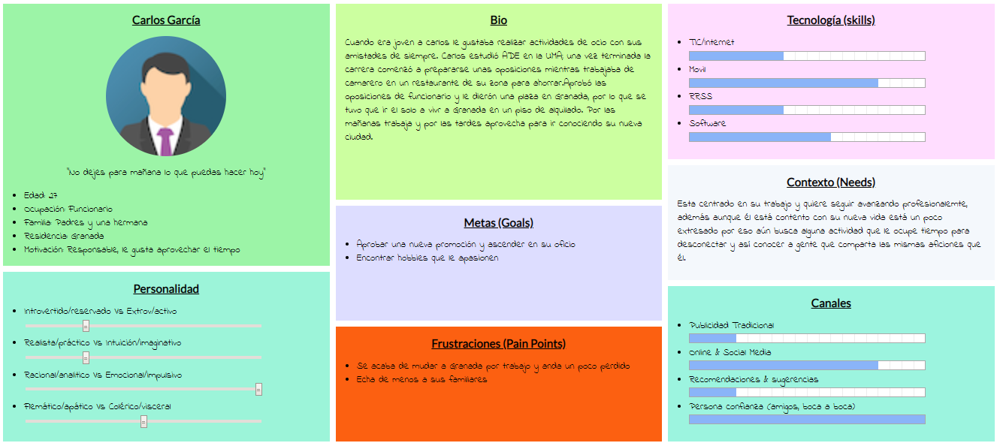
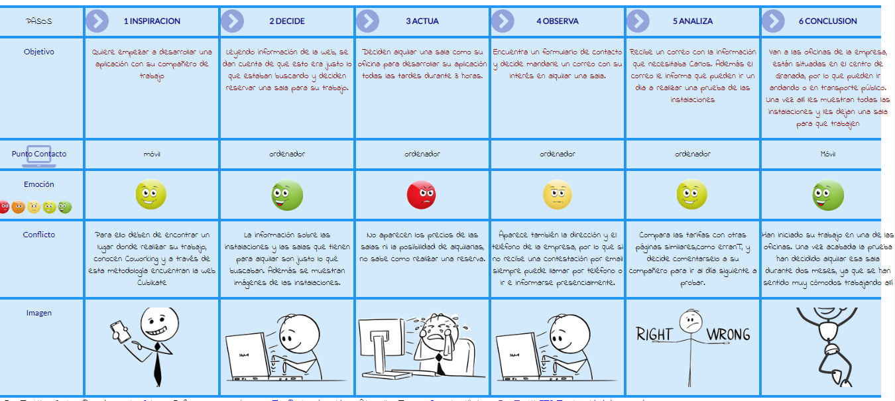

# Trabajo Final DIU
Realizado por Alejandro Bonet Medina

Introducción
-
Este trabajo tiene como objetivo evaluar tu capacidad de aplicación de las técnicas y metodologías de diseño centrado en usuario y UX a un caso real. El caso real será el rediseño de una web para una empresa de coworking, en mi caso he escogido https://cubikate.es/ para analizarla.

# Paso 1. UX Desk Research & Analisis
En primer lugar se debe analizar la experiencia de usuario en esta página, para encontrar así con sus puntos débiles y fuertes; y a partir de estos puntos comenzar con el rediseño. Para ello debemos analizar a los usuarios que harán uso de esta página y como actúan en esta y también analizar aplicaciones similares.

1a.Competive Analisis
-
Cubikate es una empresa dedicada al coworking que se encuentra en Granada, una aplicación similar a esta es erranT. Aunque las dos webs traten de lo mismo podemos encontrar multiples diferencias entre ambas. La más interesante para comentar es que en la web e cubikate no podemos alquilar directamente una sala, ni saber su disponibilidad, precio, etc. Para alquilar una sala en cubikate tienes que ponerte en contacto a través del formulario que proporcionan, mientras que en erranT podemos alquilar una sala desde la web, conociendo su disponibilidad y tarifas. También comentar que en la web erranT a la hora de navegadar aparecen problemas con el servidor por lo que hace que su navegabilidad no sea eficiente. 

1b. Personas
-
En cuanto a los personas que utilizan la web, Cubikate esta destinada a usuarios que busquen un lugar donde realizar proyectos, estos usuarios  pueden ser tanto pequeñas empresas, como autónomos o como usuarios que quieren desarrollar una idea.
Analizamos a Carlos García. Carlos es un joven que acaba de llegar a su nueva ciudad después de haber aprobado sus oposiciones de funcionario, al ser una persona joven está acostumbrado a las tecnologías y lleva su móvil siempre encima. En cuanto a su personalidad destacar que es una persona activa que le gusta aprovechar su tiempo libre.

 

1c.User Journey Map
-
Carlos, que es funcionario, trabaja por las mañanas y por las tardes suele estar en su casa aburrido realizando tareas doméstica o paseando por su nueva zona residencial. Un compañero de trabajo le comenta que se ha metido a desarrollar una aplicación en su tiempo libre y que si le quiere ayudar a desarrollarla. Para ello deben de encontrar un lugar donde trabajar, ya que la ambos viven en un piso pequeño y no tienen espacio para trabajar comodamente. 

 

